<!-- Banner em Ondas com Suporte Nativo a Modo Claro e Escuro -->
<picture>
  <source media="(prefers-color-scheme: dark)" srcset="https://capsule-render.vercel.app/api?type=waving&color=0:0f2027,50:203a43,100:2c5364&height=180&section=header&text=Kalicon%20Amorim&fontSize=42&fontAlignY=35&fontColor=ffffff&desc=Estudante%20de%20ADS%20na%20FIAP%20(2026)%20%7C%20Desenvolvimento%20Prático&descAlignY=58&descSize=17&descColor=38bdf8&animation=fadeIn">
  <source media="(prefers-color-scheme: light)" srcset="https://capsule-render.vercel.app/api?type=waving&color=0:e0eafc,100:cfdef3&height=180&section=header&text=Kalicon%20Amorim&fontSize=42&fontAlignY=35&fontColor=1e3a5f&desc=Estudante%20de%20ADS%20na%20FIAP%20(2026)%20%7C%20Desenvolvimento%20Prático&descAlignY=58&descSize=17&descColor=0969da&animation=fadeIn">
  
</picture>

<h1>Olá, mundo! Eu sou o Kalicon Amorim 👋</h1>

<!-- Tipografia Dinâmica com Contraste Ajustado (Ciano no Dark / Azul Escuro no Light) -->
<picture>
  <source media="(prefers-color-scheme: dark)" srcset="https://readme-typing-svg.demolab.com?font=Fira+Code&weight=500&size=19&duration=3000&pause=1000&color=38BDF8&center=true&vCenter=true&width=750&lines=Estudante+de+An%C3%A1lise+e+Desenvolvimento+de+Sistemas+(FIAP%2C+2026);Desenvolvedor+de+Software+focado+em+projetos+pr%C3%A1ticos;Aprendizado+acelerado+por+Intelig%C3%AAncia+Artificial+e+c%C3%B3digo+real;Java+%7C+Spring+Boot+%7C+TypeScript+%7C+Node.js+%7C+MongoDB">
  <source media="(prefers-color-scheme: light)" srcset="https://readme-typing-svg.demolab.com?font=Fira+Code&weight=600&size=19&duration=3000&pause=1000&color=0969DA&center=true&vCenter=true&width=750&lines=Estudante+de+An%C3%A1lise+e+Desenvolvimento+de+Sistemas+(FIAP%2C+2026);Desenvolvedor+de+Software+focado+em+projetos+pr%C3%A1ticos;Aprendizado+acelerado+por+Intelig%C3%AAncia+Artificial+e+c%C3%B3digo+real;Java+%7C+Spring+Boot+%7C+TypeScript+%7C+Node.js+%7C+MongoDB">
  
</picture>

  
  
  
  

 

<!-- Terminal Animado Adaptável (SVG com detecção automática de Light e Dark Mode) -->

  

---

## Sobre Mim

Sou estudante de Análise e Desenvolvimento de Sistemas na FIAP (com conclusão prevista para 2026) e desenvolvedor em início de trajetória na área de tecnologia. 

Minha postura diante do aprendizado é prática e direta: em vez de me limitar a exercícios puramente teóricos de cursos, escolhi aprender construindo sistemas reais do início ao fim. 

Utilizo ferramentas modernas de Inteligência Artificial como aliadas estratégicas para acelerar a curva de aprendizado, investigar arquiteturas, validar regras de negócio e tirar soluções completas do papel — do frontend ao backend, banco de dados e deploy.

O que venho construindo e aprimorando na prática:
- **E-Commerce Real:** Claravellas (loja virtual de velas aromáticas personalizadas com pagamentos via Stripe, banco MongoDB Atlas e deploy no Vercel).
- **Aplicações para o Setor Público:** Calculadora de apoio a escalas e dimensionamento hospitalar para o Hospital Maternidade Leonor Mendes de Barros (SES-SP).
- **Regras Complexas e Testes Automatizados:** Suíte RHUB, desenvolvida como desafio acadêmico para cálculos de Departamento Pessoal e simulação CLT vs. PJ (PWA offline e 14 testes unitários com Vitest).
- **Backend Corporativo:** IntraHub, projeto explorando padrões enterprise em Java 17 e Spring Boot 3 com Spring Security (RBAC) e documentação OpenAPI/Swagger.

---

## Metodologia de Aprendizado

- **Projetos Reais vs. Teoria Isolada:** Cada tecnologia é estudada aplicada a um problema concreto (um e-commerce de velas, um sistema hospitalar ou uma suíte de cálculos trabalhistas).
- **Desenvolvimento Assistido por IA:** Emprego IA para acelerar a escrita de código, propor testes e esclarecer conceitos avançados, mantendo o controle sobre as decisões de arquitetura e funcionamento do produto.
- **Visão End-to-End:** Interesse em compreender o fluxo completo de uma aplicação, desde a experiência e responsividade no navegador até a integridade dos dados e regras no backend.

---

## Tecnologias e Ferramentas

### Backend e APIs

### Frontend e Mobile

### Banco de Dados, Testes e Ferramentas

---

## Projetos em Destaque

<table>
  <tr>
    <td width="50%" valign="top">
      <h3>Claravellas — E-Commerce de Velas Personalizadas</h3>
      

        <a href="https://claravellas-three.vercel.app">Loja em Produção</a> | 
        <i>Repositório Privado</i>
      

      
Plataforma de e-commerce e gestão para velas aromáticas personalizadas e produtos artesanais de alto padrão.

      <ul>
        <li>Storefront responsivo com foco em experiência de compra fluida e Core Web Vitals.</li>
        <li>Integração de pagamentos e checkout seguro via Stripe.</li>
        <li>Painel administrativo modular para controle de pedidos, estoque e relatórios de vendas.</li>
        <li><b>Stack:</b> Node.js, MongoDB Atlas, Stripe API, JavaScript, HTML5/CSS3, Vercel.</li>
      </ul>
    </td>
    <td width="50%" valign="top">
      <h3>RHUB — Suíte de Cálculos CLT e DP</h3>
      

        <a href="https://kalicon.github.io/RHUB/">App Online</a> | 
        <a href="https://github.com/Kalicon/RHUB">Código Fonte</a>
      

      
Aplicação web para simulações trabalhistas da legislação brasileira e comparador de custos CLT vs. PJ com cálculo de ponto de equilíbrio.

      <ul>
        <li>Funcionamento offline completo via Progressive Web App (PWA).</li>
        <li>14 testes unitários automatizados com Vitest cobrindo regras legais de cálculo.</li>
        <li>Exportação estruturada de dados para planilhas Excel (.xlsx) e layout para impressão técnica.</li>
        <li><b>Stack:</b> JavaScript (ES6 Modules), Tailwind CSS, Vitest, SheetJS, Chart.js.</li>
      </ul>
    </td>
  </tr>
  <tr>
    <td width="50%" valign="top">
      <h3>IntraHub — Portal Corporativo e Intranet</h3>
      

        <a href="https://github.com/Kalicon/IntraHub">Código Fonte</a>
      

      
Sistema web corporativo para centralização de fluxos departamentais, comunicação interna e controle de conformidade.

      <ul>
        <li>Replicação automatizada de escalas de equipes em lote.</li>
        <li>Controle de acesso granular baseado em papéis (RBAC) com Spring Security.</li>
        <li>Documentação de endpoints integrada via OpenAPI / Swagger UI.</li>
        <li><b>Stack:</b> Java 17, Spring Boot 3.2, Spring Security 6, Hibernate/JPA, Bootstrap 5.</li>
      </ul>
    </td>
    <td width="50%" valign="top">
      <h3>Calculadora de Escalas Hospitalares (SES-SP)</h3>
      

        <a href="https://kalicon.github.io/Calculadora/">App Online</a> | 
        <a href="https://github.com/Kalicon/Calculadora">Código Fonte</a>
      

      
Ferramenta desenvolvida para apoio às chefias e equipes do Hospital Maternidade Leonor Mendes de Barros (UGA IV).

      <ul>
        <li>Algoritmo de alternância de plantões mensais para compensação semestral de jornadas reduzidas.</li>
        <li>Estimativa de dimensionamento de equipe de enfermagem baseada na Resolução COFEN 743/2024.</li>
        <li>Orientador de conformidade para limites de plantões (LC 1176/2012).</li>
        <li><b>Stack:</b> JavaScript, HTML5/CSS3, lógica auxiliar em Java.</li>
      </ul>
    </td>
  </tr>
</table>

---

## Atividade no GitHub

  <!-- Cobrinha com Suporte Nativo a Dark e Light Mode -->
  <picture>
    <source media="(prefers-color-scheme: dark)" srcset="https://raw.githubusercontent.com/Kalicon/Kalicon/output/github-contribution-grid-snake-dark.svg">
    <source media="(prefers-color-scheme: light)" srcset="https://raw.githubusercontent.com/Kalicon/Kalicon/output/github-contribution-grid-snake.svg">
    
  </picture>

    

  <!-- Cards de Estatísticas com Suporte Nativo a Dark e Light Mode -->
  <table border="0">
    <tr>
      <td align="center">
        <picture>
          <source media="(prefers-color-scheme: dark)" srcset="https://github-profile-summary-cards.vercel.app/api/cards/stats?username=Kalicon&theme=tokyonight">
          <source media="(prefers-color-scheme: light)" srcset="https://github-profile-summary-cards.vercel.app/api/cards/stats?username=Kalicon&theme=default">
          
        </picture>
      </td>
      <td align="center">
        <picture>
          <source media="(prefers-color-scheme: dark)" srcset="https://github-profile-summary-cards.vercel.app/api/cards/most-commit-language?username=Kalicon&theme=tokyonight">
          <source media="(prefers-color-scheme: light)" srcset="https://github-profile-summary-cards.vercel.app/api/cards/most-commit-language?username=Kalicon&theme=default">
          
        </picture>
      </td>
    </tr>
  </table>

   

  <!-- Sequência de Commits Adaptável -->
  <picture>
    <source media="(prefers-color-scheme: dark)" srcset="https://streak-stats.demolab.com/?user=Kalicon&theme=tokyonight&hide_border=true&background=0D1117&stroke=38BDF8&ring=38BDF8&fire=38BDF8&currStreakLabel=38BDF8">
    <source media="(prefers-color-scheme: light)" srcset="https://streak-stats.demolab.com/?user=Kalicon&theme=github-light-compact&hide_border=true&background=F6F8FA&stroke=0969DA&ring=0969DA&fire=0969DA&currStreakLabel=0969DA">
    
  </picture>

---

## Contato

- Email: [kalicon.amorim@hotmail.com](mailto:kalicon.amorim@hotmail.com)
- Localização: São Paulo, SP - Brasil
- GitHub: [github.com/Kalicon](https://github.com/Kalicon)
- Portfólio Web: [kalicon.github.io](https://kalicon.github.io)
